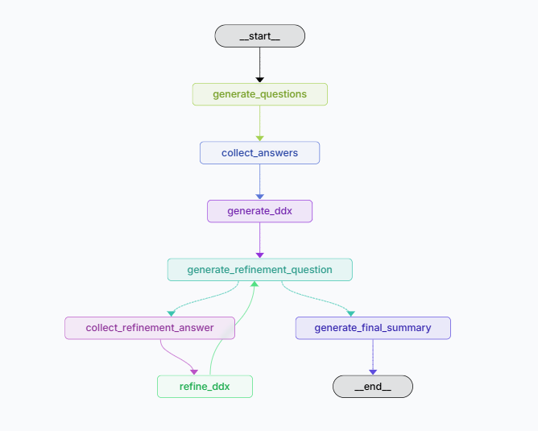

# Structured DDx Agent 🩺

> **A Human-in-the-Loop clinical reasoning agent. Implements hypothetico-deductive logic for structured differential diagnosis (DDx) using LangGraph.**

This project demonstrates an agentic workflow for medical triage that moves beyond simple chatbots. Instead of generating linear text, the agent actively builds a probabilistic differential diagnosis, identifies clinical ambiguity, and generates targeted screening questions to rule conditions in or out.

## 🧠 Clinical Logic Architecture

The system mimics the **Hypothetico-Deductive Reasoning** process used by clinicians:

1.  **Initial Triage:** Collects presenting symptoms and history.
2.  **Differential Diagnosis (DDx):** Generates a structured list of potential conditions, ranked by probability and severity (e.g., "Life Threatening" vs. "Mild").
3.  **Refinement Loop:** The core reasoning engine. It identifies the condition with the highest uncertainty and generates *one* specific question to test that hypothesis.
4.  **Human-in-the-Loop (HITL):** Using LangGraph's `interrupt` mechanism, the system pauses execution to validate input with the user, ensuring safety and preventing hallucinations.

### System Flow

```mermaid
graph TD
    A["Patient Input: 'Headache'"] --> B{"Initial Triage AI"}
    B -->|Generate| C["Screening Questions"]
    C --> D(("Human-in-the-Loop"))
    D -->|Patient Answers| E["Generate Differential Diagnosis (DDX)"]
    
    subgraph RefinementLoop ["Clinical Refinement Loop"]
    E --> F{"High Confidence OR<br/>Safety Threshold Met?"}
    F -- No --> G["Identify Top Ambiguity"]
    G --> H["Generate Targeted<br/>Rule-In/Rule-Out Question"]
    H --> I(("Human-in-the-Loop"))
    I -->|New Evidence| J["Refine Probabilities & Severity"]
    J --> F
    end
    
    F -- Yes --> K["Final Clinical Summary<br/>& Triage Advice"]
    
    style D fill:#f9f,stroke:#333,stroke-width:2px
    style I fill:#f9f,stroke:#333,stroke-width:2px
    style F fill:#bbf,stroke:#333,stroke-width:2px
````

### Graph Topology



## 🛠️ Tech Stack

  * **Orchestration:** [LangGraph](https://langchain-ai.github.io/langgraph/) (Cyclic state management)
  * **LLM:** OpenAI GPT-4o
  * **Validation:** [Pydantic](https://www.google.com/search?q=https://docs.pydantic.dev/) (Strict schemas for Clinical Data)
  * **Pattern:** Human-in-the-Loop (HITL) via state checkpoints

## 🚀 Key Features

  * **Cyclic Reasoning:** The graph loops dynamically based on the confidence of the diagnosis, simulating a doctor "thinking" through a case.
  * **Structured Output:** The agent does not return strings; it returns strict Python objects for reliability:
    ```python
    class Diagnosis(BaseModel):
        condition: str
        probability: float
        severity: str  # e.g., "life_threatening"
        reasoning: str
    ```
  * **Safety Guardrails:** Emergency conditions (red flags) are tracked explicitly in the state metadata.

## 📦 Quick Start

### 1\. Clone the repository

```bash
git clone https://github.com/navidmovafeghi/structured-ddx-agent.git
cd structured-ddx-agent
```

### 2\. Set up environment

Create a `.env` file in the root directory and add your OpenAI API key:

```text
OPENAI_API_KEY=sk-your-key-here
```

### 3\. Install dependencies

```bash
pip install -r requirements.txt
```

### 4\. Run the agent

```bash
python src/graph.py
```

## ⚠️ Disclaimer

**This is an architectural demonstration of AI reasoning patterns, not a medical device.**

It is designed to showcase how LangGraph can model complex decision-making loops in healthcare. It should **not** be used for actual medical diagnosis, triage, or treatment. Always consult a qualified healthcare provider for medical issues.


